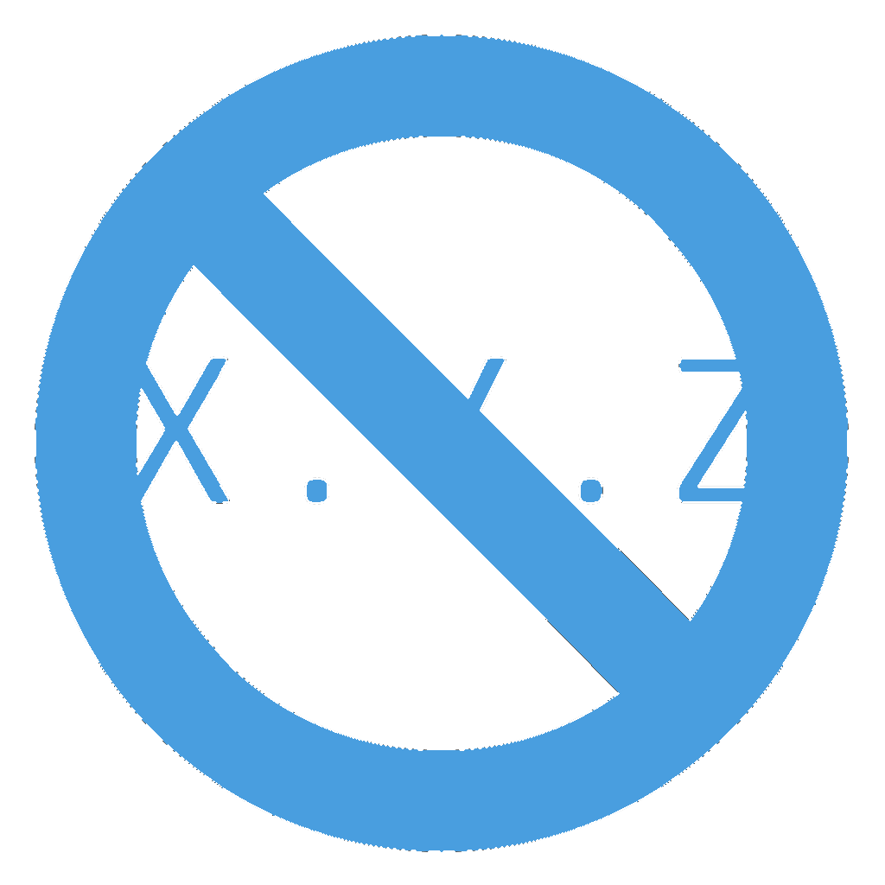
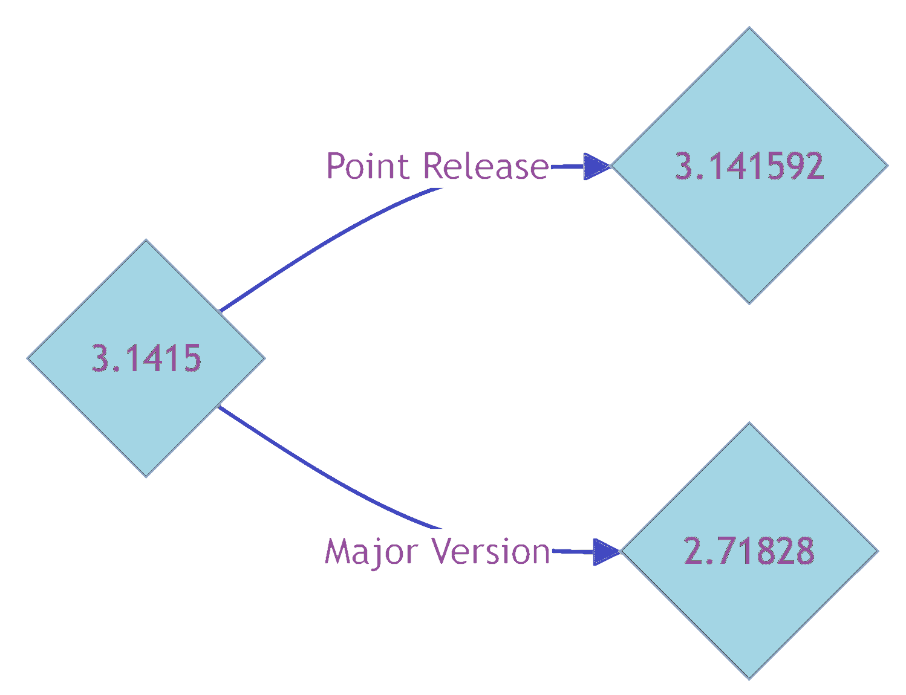

# NopVer Specification v2.71828

Just out of spite (and to take a good laugh at ourselves), I propose we create
a **"NopVer"** specification:

## Basic Idea

The author of the component creates an initial version, let's say it is 3.1415.
Another major version, say 2.71828, indicating 3.1415 as the parent version.
A later point version, say 3.141592 would point to 3.1415 as its parent version.

## How it works

In software using that component, In order to figure out if any version is 
compatible to the one specified in given requirements file, the software resolver should download
all versions, perform a topological sort and then conclude that this version is indeed usable by
the dependent.

If there are conflicting versions of a package that come through a graph of two dependencies
then their common ancestor will be chosen, and if none of those ancestors satisfy the criteria,
an error shall be thrown.

## Rationale (or the lack of it)

Software development is not meant to be a perfect process.

There is no meaning associated with any digits or any dots in the versions. Your versions
are encouraged to be irrational, alphanumeric and 🍌, thereby letting you run software
with your rationale.

## Feedback

Comments are welcome. Forks and PRs welcome.